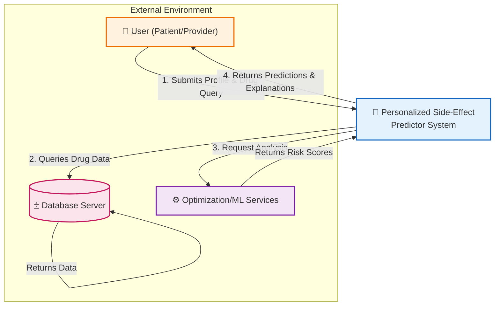

# 4.2 Context Diagram

The diagram below outlines how the **Personalized Side-Effect Predictor** engages with external actors and infrastructure. This perspective establishes the system's operational scope, highlighting the flow of data across its boundaries while differentiating core functionality from external dependencies.

Positioned at the center of this ecosystem, the **Personalized Side-Effect Predictor** orchestrates communication between healthcare stakeholders (patients and providers), persistent storage layers, and the computational engines driving side-effect modeling.

*Image 4.2: Context Diagram*

### Explanation of Context Diagram Components

*   **User (Patient/Healthcare Provider)**: The user represents individuals who interact with the system. Patients use the system to input their health profiles (age, sex, conditions) and search for medications to get side-effect predictions. Healthcare providers may use it to validate risks. Users interact through a web browser interface.
*   **Personalized Side-Effect Predictor System**: This is the central system that processes all user interactions. It receives the user's demographic and medical data, validates it, and orchestrates the prediction process. It acts as the bridge between the user interface, the database, and the analytical services.
*   **External Services (ML & NLP Modules)**: These services support the core intelligence of the system. The Python-based Machine Learning and NLP services analyze patient data against training models and drug text descriptions to generate probability scores and risk assessments.
*   **Database Server**: The database server (MongoDB) stores all persistent data. It holds the comprehensive drug database, user-submitted profiles (temporarily or persistently for sessions), and logging data for system auditing. It ensures data is retrieved securely and efficiently.

### Data Flow Description

*   **User** sends input to the system, including personal health details (Age, Sex, Conditions) and the medication name they wish to check.
*   **The System** processes this input, validating the data format.
*   **The System** queries the **Database Server** to retrieve details about the requested medication.
*   **The System** forwards the patient profile and drug data to the **External Services** (ML/NLP engines) for analysis.
*   **External Services** perform the risk calculation and return weighted probability scores to the system.
*   **The System** consolidates these scores into a user-friendly report with explanations and risk levels (High/Medium/Low).
*   **The System** formats and sends the final output back to the **User** interface for display.
