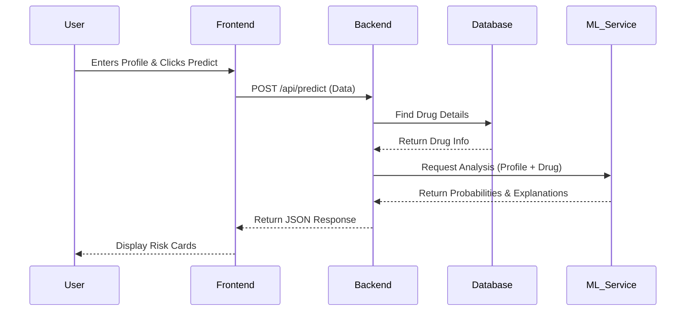
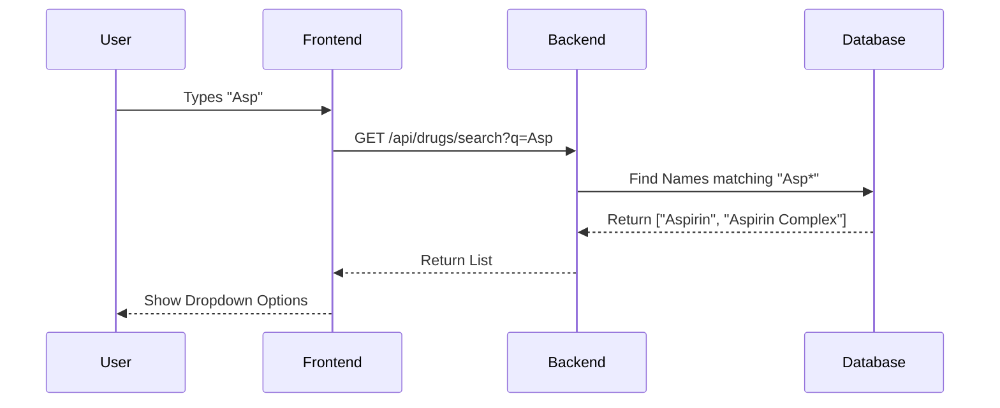
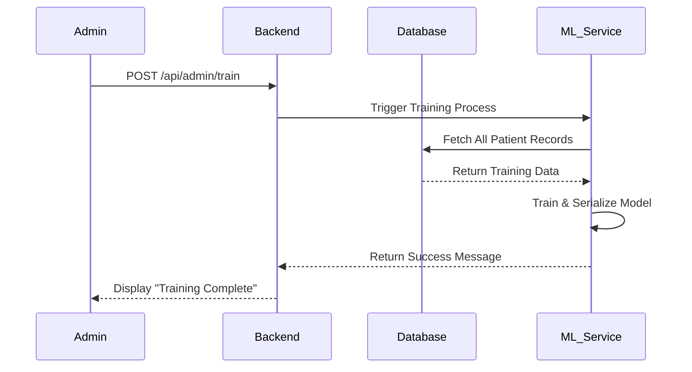
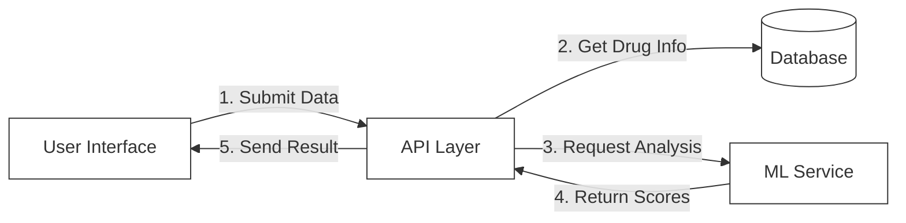
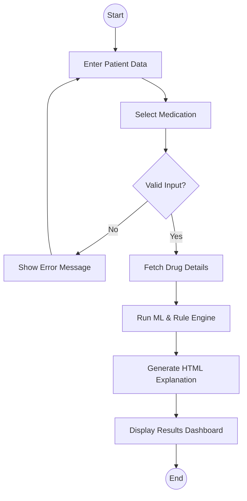
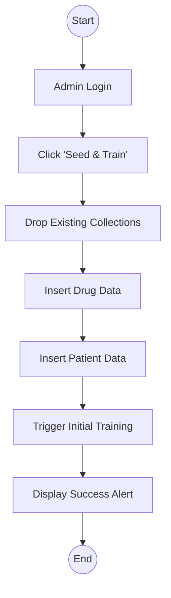
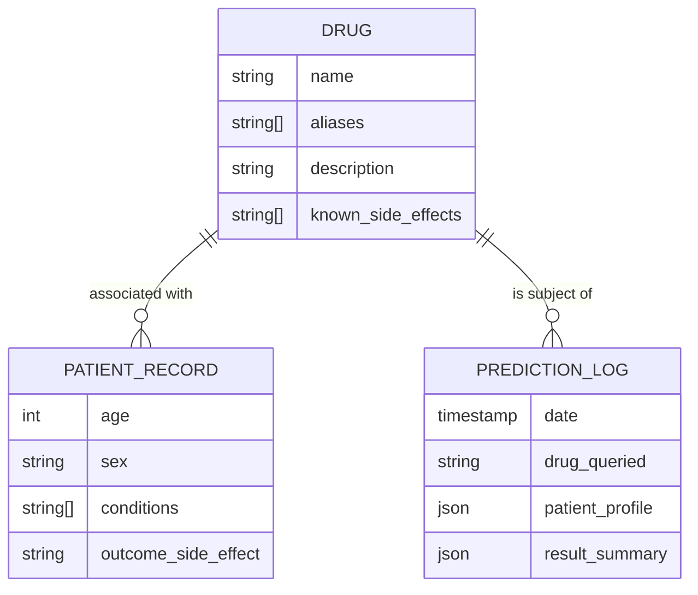

# CHAPTER 05
# DETAILED DESIGN

This chapter presents the detailed design of the **Personalized Side-Effect Predictor** system using standard design diagrams. Detailed design explains how the system components interact internally and how user requests are processed step by step. The diagrams included in this chapter help visualize system functionality, data flow, and database structure in a clear and structured manner.

The design is presented using Use Case Diagrams, Sequence Diagrams, Collaboration Diagrams, Activity Diagrams, and Database Design diagrams. Each diagram is explained in detail to provide clarity on system behavior and workflow.

## 5.1 Use Case Diagram

The Use Case Diagram describes the functional requirements of the system from the user’s perspective. It identifies the different operations a user can perform and defines the interaction between the user and the system.

### 5.1.1 Actor Identification

*   **Patient (End User)**: Individuals who use the system to check potential side effects of medications based on their health profile.
*   **Healthcare Provider**: Medical professionals who use the system to validate risks and access detailed reports.
*   **Administrator**: Manages the system, performs database seeding, and triggers model retraining.

### 5.1.2 Overall Use Case Diagram (Textual Representation for Mermaid)

**Major Use Cases:**
*   Search for Drug
*   Input Patient Profile
*   Get Side-Effect Prediction
*   View Risk Explanations
*   Admin: Seed Database
*   Admin: Retrain Model

```mermaid
usecaseDiagram
    actor Patient as "Patient"
    actor Provider as "Healthcare Provider"
    actor Admin as "Administrator"

    package "Personalized Side-Effect Predictor" {
        usecase "Search for Drug" as UC1
        usecase "Input Health Profile" as UC2
        usecase "Get Prediction & Explanation" as UC3
        usecase "View Risk Dashboard" as UC4
        usecase "Seed Database" as UC5
        usecase "Train ML Model" as UC6
    }

    Patient --> UC1
    Patient --> UC2
    Patient --> UC3
    
    Provider --> UC1
    Provider --> UC2
    Provider --> UC3
    Provider --> UC4

    Admin --> UC5
    Admin --> UC6
```
*Image 5.1: Use Case Diagram*

### 5.1.3 Use Case Description – Get Prediction

| Field | Description |
| :--- | :--- |
| **Use Case Name** | Get Prediction & Explanation |
| **Actor** | Patient, Healthcare Provider |
| **Description** | Allows the user to get personalized side-effect risks based on their profile. |
| **Input** | Drug Name, Age, Sex, Medical Conditions |
| **Output** | List of side effects with probability scores and text explanations. |
| **Pre-condition** | System is online, Drug exists in database. |
| **Post-condition** | Prediction results are displayed and logged. |

### 5.1.4 Use Case Description – Search for Drug

| Field | Description |
| :--- | :--- |
| **Use Case Name** | Search for Drug |
| **Actor** | Patient, Healthcare Provider |
| **Description** | Allows the user to find a specific medication using autocomplete. |
| **Input** | Partial drug name (e.g., "Asp") |
| **Output** | List of matching drugs (e.g., "Aspirin", "Aspirin Low Dose") |
| **Pre-condition** | Database is populated. |
| **Post-condition** | User selects a valid drug. |

### 5.1.5 Use Case Description – Train ML Model

| Field | Description |
| :--- | :--- |
| **Use Case Name** | Train ML Model |
| **Actor** | Administrator |
| **Description** | Triggers the Python service to retrain the machine learning models. |
| **Input** | "Train" command via Admin Dashboard |
| **Output** | Success message with training metrics (accuracy, precision). |
| **Pre-condition** | Training data exists in the database. |
| **Post-condition** | New model is saved and loaded for predictions. |

---

## 5.2 Sequence Diagram

Sequence diagrams represent the interaction between system components over time. These diagrams explain how a particular operation is carried out from user input to database execution.

### 5.2.1 Sequence Diagram – Get Prediction Flow

*   User submits profile data and drug name.
*   Frontend (React) sends request to Backend (Node.js).
*   Backend fetches drug details from MongoDB.
*   Backend calls Python ML Service for analysis.
*   ML Service returns risk scores.
*   Backend returns formatted response to User.


*Image 5.2.1: Sequence Diagram – Get Prediction*

### 5.2.2 Sequence Diagram – Drug Search (Autocomplete)

*   User types in search bar.
*   Frontend sends partial string to Backend.
*   Backend queries Database with regex.
*   Database returns matching names.
*   User sees dropdown options.


*Image 5.2.2: Sequence Diagram – Drug Search*

### 5.2.3 Sequence Diagram – Admin Model Training

*   Admin clicks "Train Model".
*   Backend triggers Python script.
*   Python script reads all training data from DB.
*   Model is trained and saved.
*   Success status returned.


*Image 5.2.3: Sequence Diagram – Admin Model Training*

---

## 5.3 Collaboration Diagram

Collaboration diagrams emphasize how different system components cooperate to complete a task. They focus on object relationships rather than time sequence.

### 5.3.1 Collaboration Diagram – Prediction Processing

**Components involved:**
*   Patient UI
*   API Gateway (Express)
*   Drug Controller
*   ML Service Adapter
*   MongoDB


*Image 5.3.1: Collaboration Diagram – Prediction Processing*

---

## 5.4 Activity Diagram

Activity diagrams describe the workflow of operations performed by the system. They represent decision-making and control flow.

### 5.4.1 Activity Diagram – Prediction Workflow

1.  Start
2.  User enters Age, Sex, Conditions
3.  User selects Drug
4.  System Validates Input (Is Age valid?)
5.  If Invalid -> Show Error
6.  If Valid -> Fetch Drug Data -> Calculate Risks -> Generate Explanation
7.  Display Results
8.  End


*Image 5.4.1: Activity Diagram – Prediction Workflow*

### 5.4.2 Activity Diagram – Admin Data Seeding

1.  Start
2.  Admin checks database status
3.  Click "Seed Database"
4.  Clear existing collections
5.  Insert Drug JSON Data
6.  Insert Synthetic Patient Data
7.  Display "Seeding Complete"
8.  End


*Image 5.4.2: Activity Diagram – Admin Data Seeding*

---

## 5.5 Database Design (ER & Conceptual Schema)

Database design defines how data is structured and stored within the system. The system uses a document-oriented NoSQL design (MongoDB) but can be visualized with Entity-Relationship concepts.

### 5.5.1 Entity Relationship Diagram

**Entities:**
*   **Drug**: Stores medication metadata and known side effects.
*   **PatientRecord**: Stores historical/training data (Age, Sex, Conditions, Outcome).
*   **PredictionLog**: Stores live user queries for analytics.


*Image 5.5.1: Entity Relationship Diagram*

### 5.5.2 Relationships & Schema Details

*   **Drug Collection**: The core entity. Contains static medical knowledge.
*   **PatientRecord Collection**: Used for training the Machine Learning model. Acts as the "experience" memory of the system.
*   **PredictionLog Collection**: Usage history. Used by Admins to see what users are searching for and how the model is performing in the wild.

One **Drug** can link to many **Patient Records** (people who took it) and many **Prediction Logs** (people asking about it).
