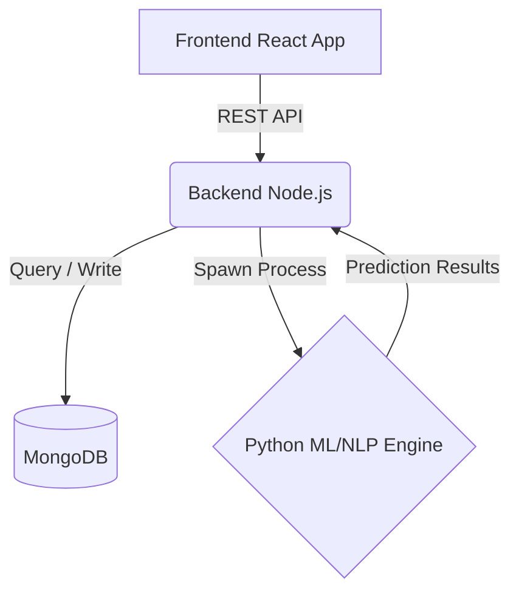

<div align="center">

# 💊 Personalized Medication Side-Effect Predictor

[](https://reactjs.org/)
[](https://nodejs.org/)
[](https://www.python.org/)
[](https://www.mongodb.com/)
[](https://www.docker.com/)

An AI-powered web application that predicts potential medication side effects based on drug information and patient characteristics using a hybrid approach combining Rule-based logic, Machine Learning, and NLP.

> **⚠️ DISCLAIMER: For educational and demonstration purposes only. This is not medical advice. Always consult a healthcare professional.**

</div>

---

## ✨ Features

- 🔍 **Drug Search**: Autocomplete drug lookup from a comprehensive database.
- 👤 **Patient Profiling**: Considers Age, Sex, and pre-existing conditions.
- 🧠 **Hybrid Prediction Engine**: Combines Rule-based Logic, ML, and NLP scoring.
- 📊 **Explainability**: Understand exactly *why* a side effect is predicted.
- 🚦 **Risk Indicators**: Visual risk levels (Low / Moderate / High).
- 🛠️ **Admin Panel**: Easily seed the database and view training metrics.

---

## 🚀 Quick Start (Docker)

The fastest way to get the project running locally is using Docker.

```bash
# 1. Clone the repository
git clone https://github.com/vinaymca24-2507/Personalized-Medication-Side-Effect-Prediction.git
cd personalized-sideeffect-predictor

# 2. Start all services using Docker Compose
docker compose up --build

# 3. Seed the database and train the model (Required on first run)
curl -X POST http://localhost:5000/api/seed
```

### 🌍 Access Points
- **Frontend App**: `http://localhost:3000`
- **Backend API**: `http://localhost:5000`

---

## 🏗️ Architecture



---

## 🤖 Hybrid Algorithm

Our unique prediction engine combines three specialized approaches to ensure accuracy and context-awareness:

1. **Rule-based (35%)**: Hardcoded rules for high-risk demographics (e.g., age > 65 or specific liver conditions).
2. **ML Model (45%)**: An ensemble method using historical patient data to predict multi-label side effects based on features like age, sex, and health history.
3. **NLP (20%)**: TF-IDF similarity scoring based on drug descriptions to catch historically documented symptoms.

*(Weights are configurable via environment variables)*

---

## 🧠 Machine Learning Algorithms

The core of our ML prediction engine utilizes a **Hybrid Ensemble Method** to maximize accuracy and minimize false positives. We leverage the following algorithms:

- **Logistic Regression**: Used as the baseline model to handle linearly separable features and provide clear probabilistic outputs for individual side effects.
- **Random Forest Classifier**: Handles non-linear relationships between patient conditions and side effects. Its bagging technique prevents overfitting on our synthetic datasets.
- **Support Vector Machine (SVM)**: Utilized for its effectiveness in high-dimensional spaces, particularly when dealing with the complex, multi-label nature of drug interactions.

These models are combined to generate a robust prediction score, which is then weighted alongside the Rule-based and NLP modules.

---

## 💻 Local Development (Without Docker)

If you prefer to run the services directly on your host machine:

### 1️⃣ Database Setup
Ensure you have MongoDB running locally on port `27017` or use Docker:
```bash
docker run -d -p 27017:27017 --name mongo mongo:6.0
```

### 2️⃣ Backend Setup
```bash
cd backend
npm install
pip install -r requirements.txt
npm run dev
```

### 3️⃣ Frontend Setup
```bash
cd frontend
npm install
npm run dev
```

---

## 🔧 API Reference

| Endpoint | Method | Description |
|----------|--------|-------------|
| `/api/predict` | `POST` | Get side-effect predictions |
| `/api/drugs?q=` | `GET`  | Search & filter drugs |
| `/api/seed`    | `POST` | Seed DB & train the ML model |
| `/api/health`  | `GET`  | Service health status |

<details>
<summary><b>View /api/predict Example Request</b></summary>

```bash
curl -X POST http://localhost:5000/api/predict \
  -H "Content-Type: application/json" \
  -d '{
    "drugName": "Aspirin",
    "age": 72,
    "sex": "M",
    "conditions": ["heart disease"]
  }'
```
</details>

---

## 🛡️ Security & Ethics

- **Security**: Implements Input Validation, Rate Limiting (100 req/min), and strict CORS policies.
- **Ethics**: Predictions are based on synthetic data and are **not clinically validated**. Should never be used for real-world treatment decisions. 

To deploy in a real-world scenario, this project would require integration with validated datasets (like SIDER or FAERS) and rigorous clinical testing.

---

## 📁 Project Structure

```text
📦 Personalized-Medication-Side-Effect-Prediction
 ┣ 📂 backend/         # Node.js Server & Python ML Scripts
 ┣ 📂 frontend/        # React User Interface
 ┣ 📂 infra/           # Dockerfiles & Nginx Configs
 ┣ 📜 docker-compose.yml
 ┗ 📜 README.md
```

---

## 📝 License

Distributed under the **MIT License**. For educational purposes only.
