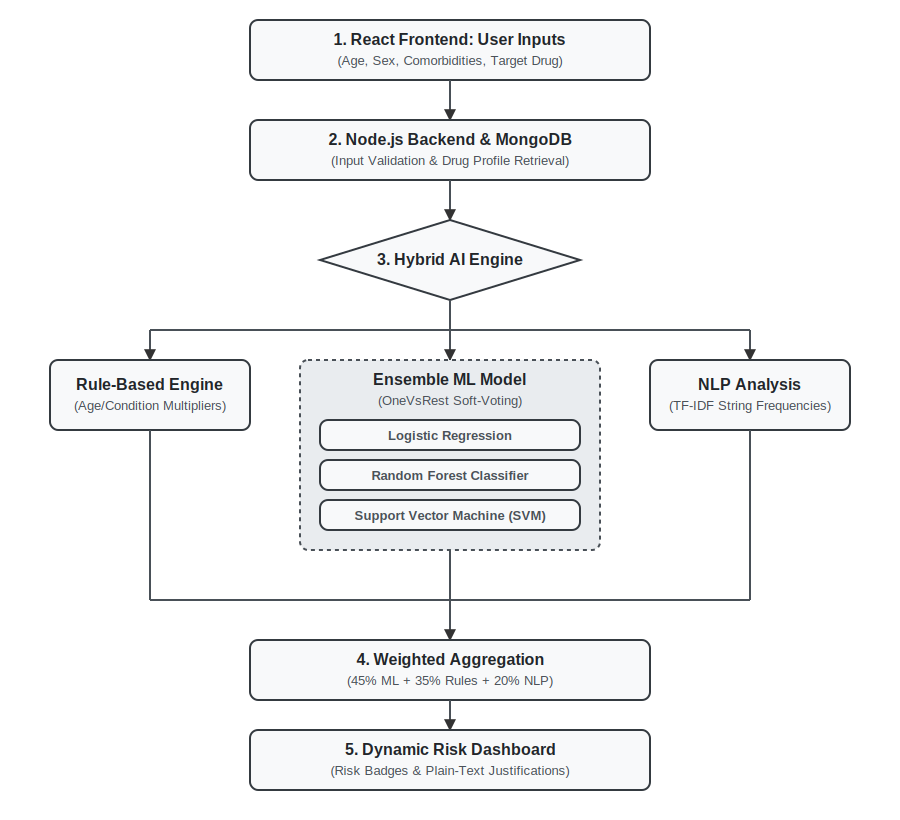
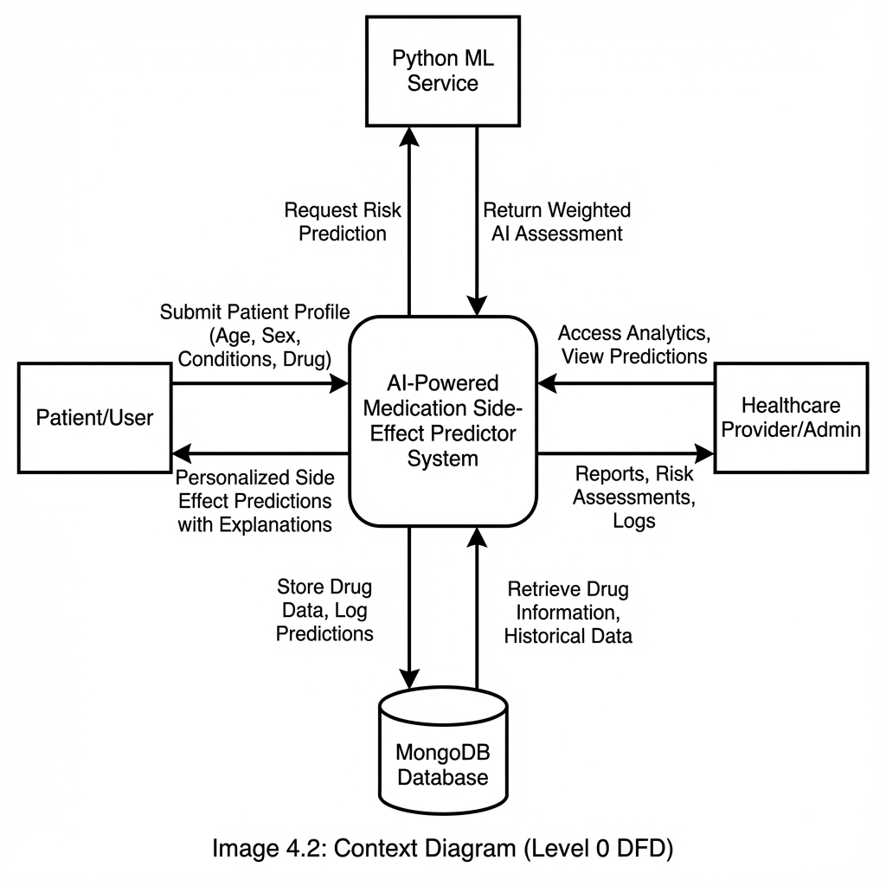
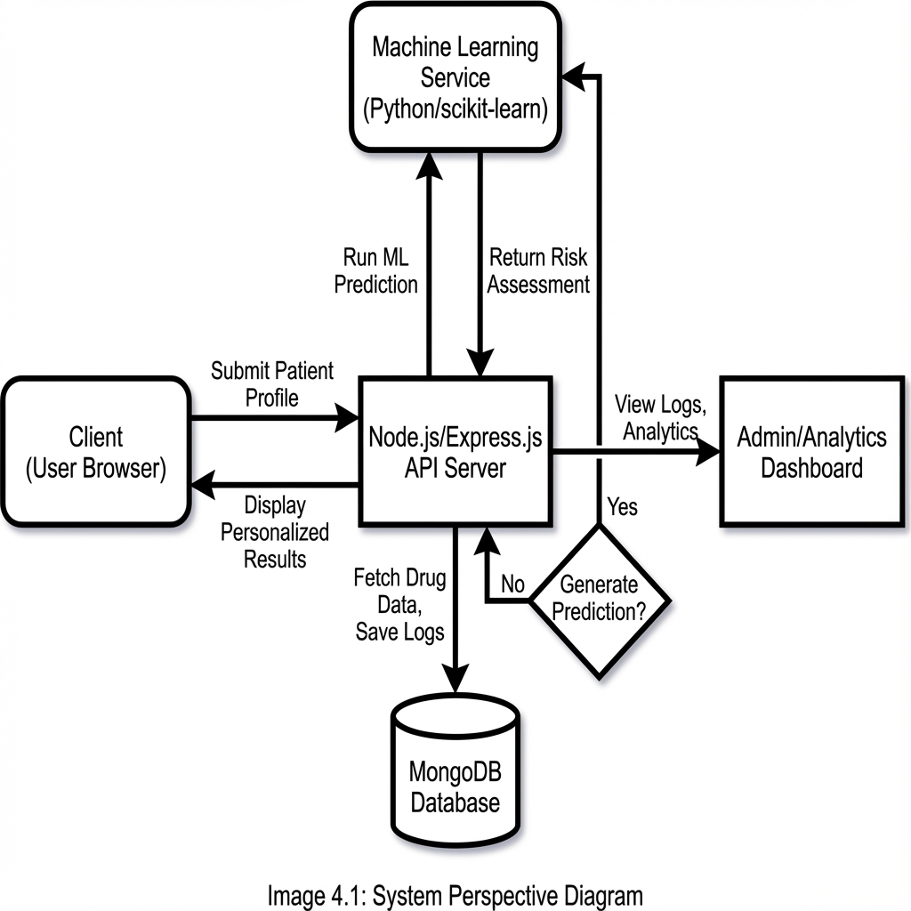

# A Hybrid Ensemble Approach for Personalized Medication Side-Effect Prediction Incorporating Rule-Based Systems and Machine Learning

**Abstract**
This paper explores the crucial domain of personalized pharmacovigilance and predictive clinical decision support for patient safety. The primary challenge in medication prescribing is that traditional drug labels offer generalized side-effect warnings. These static labels fail to account for complex, individual variables like biological age, sex, and multifactorial pre-existing comorbidities, leading to unpredictable and highly preventable Adverse Drug Reactions (ADRs). To address this critical gap, we propose the Personalized Medication Side-Effect Predictor, an interactive, web-based system designed to dynamically and accurately assess patient-specific pharmacological risks. This solution employs a novel Hybrid Artificial Intelligence architecture. It aggregates predictions from three distinct computational paradigms: a deterministic clinical Rule-Based Engine, an ensemble Machine Learning model (incorporating Logistic Regression, Random Forest, and SVM via a OneVsRest framework), and Natural Language Processing (NLP). The outcome is an Explainable AI (XAI) tool capable of generating customized, multi-label probability predictions with transparent reasoning, reducing critical medical oversights. (152 words)

**Keywords:** Adverse Drug Reaction (ADR), Personalized Medicine, Hybrid Artificial Intelligence, Machine Learning Ensemble, Explainable AI (XAI), Clinical Decision Support System (CDSS), Pharmacovigilance.

---

## 1. Introduction

The monitoring of patient safety through pharmacovigilance and predictive clinical decision support systems occupies a central role in modern healthcare. Clinicians constantly balance the therapeutic benefits of a medication against its inherent risks. However, mapping specific drug effects to an individual patient remains an extremely difficult variable to pin down in high-volume hospital settings. While massive databases exist detailing chemical side effects, accessing and personalizing that data to match a patient's exact biological profile is often impractical during standard short-duration clinical visits. Because of this, predicting adverse drug events before they occur is critical for reducing hospital readmissions and preventing severe health complications. The intersection of clinical rules data and patient medical histories forms the core area of study, aiming to evaluate the real-world effects of complex chemical compounds on varying biological profiles dynamically.

The primary challenge in medication prescribing is that traditional drug labels offer highly generalized side-effect warnings. A medication that operates perfectly for a healthy younger adult might easily trigger severe side effects like internal bleeding or sudden liver toxicity in older patients dealing with pre-existing heart disease. Static labels completely fail to account for complex, individual variables such as biological age, sex, metabolic differences, and polypharmacy interactions resulting from multifactorial pre-existing comorbidities. When automated prescription checks rely entirely on generalized data or simple binary crossing, they lack individualization and produce either excessive false alarms or miss complex drug-disease interactions, directly leading to unpredictable and highly preventable Adverse Drug Reactions (ADRs). Furthermore, data sparsity and the lack of transparency in many modern deep learning solutions make medical professionals hesitant to trust algorithmic systems.

To address this critical gap, we propose the Personalized Medication Side-Effect Predictor, a fully interactive, web-based system specifically engineered to dynamically and accurately assess patient-specific pharmacological risks. The proposed system deliberately moves away from single-algorithm models or rigid lookup tables. By prioritizing dynamic multi-label predictions, the system enables an end-user to generate personalized risk assessments instantly. Rather than giving a blind risk output, the system processes demographic age, sex, and identified diseases in tandem with the requested drug. This creates a multi-layered filter that outputs side-effect probabilities uniquely tailored to the individual rather than the general population.

Driving this solution is a robust technology stack built upon a Hybrid Artificial Intelligence architecture. The system aggregates analytical predictions from three vastly different computational paradigms. The analytical heavyweight is an ensemble Machine Learning model utilizing Logistic Regression, Random Forest, and Support Vector Machines aggregated through soft voting techniques within a OneVsRest framework on a Python background. This handles high-dimensional patient data variations. Alongside the ML framework runs a deterministic Rule-Based Engine for hard medical boundaries and a Natural Language Processing (NLP) handler that decodes semantic frequencies in established medical texts. The entire pipeline sits behind a Node.js Express server running a React.js client interface, ensuring low-latency communication and a seamless user experience.

The direct outcome of this technological fusion is a highly transparent Explainable AI (XAI) tool capable of generating customized, multi-label probability predictions. Beyond simply outputting calculated percentages, the system generates plain-text reasoning breaking down exactly how it arrived at a specific risk level. This ensures that the platform performs not merely as a statistical calculator, but as a clinically interpretable support module. It successfully bridges the gap between static pharmaceutical data and dynamic clinical reality, ultimately empowering healthcare professionals to optimize therapeutic outcomes and mitigate the risk of adverse clinical events entirely.

---

## 2. Literature Review

### A. Existing System
The monitoring and prediction of adverse drug reactions (ADRs) have been studied for decades with the objective of allowing healthcare providers to better understand pharmaceutical risks. Early systems relied heavily on spontaneous clinical reporting. Databases such as the FDA Adverse Event Reporting System (FAERS) and SIDER [2][10] provided exhaustive side effect lists, yet their retrospective nature restricted proactive individualized risk assessments. Clinical Decision Support System analyses have continuously highlighted traditional approaches to medication safety, emphasizing their limits when handling polypharmacy [14]. As machine learning improved, researchers adopted data-mining strategies to discover hidden drug-event associations in massive clinical datasets [1]. Deep learning techniques later structured health records to reliably identify general readmission risks [3]. As clinical interactions proved complex, researchers focused on multi-label learning algorithms capable of mapping overlapping condition risks [5].

Libraries like Scikit-learn accelerated the implementation of these statistical models across the healthcare programming space [8]. Researchers subsequently pushed natural language processing (NLP) to extract highly detailed semantic meaning from previously unstructured pharmaceutical documentation [9][12]. Other efforts utilized Bayesian neural networks for reactive signal generation regarding drug reactions [11], integrated relational machine-learning directly into side-effect profiling frameworks [13], and implemented interpretable predictive modeling emphasizing reverse time attention [15]. A massive emphasis on the convergence of human input and high-performance algorithms has guided the field [4]. Despite this progress, "black box" algorithms struggle tremendously with real-world implementation reliability, failing to effectively synthesize rigid expert clinical rules with statistical ML logic. Medical researchers aggressively underscore the necessity for Explainable AI (XAI) in the medical domain [6][7], concluding that predictive support systems must provide transparent reasoning tracks rather than hiding behind unreadable deep learning nodes.

### B. Proposed System
The proposed Personalized Medication Side-Effect Predictor is designed as an interactive web-based support platform addressing the specific limitations discussed above. The system shifts away from generic static profiles by allowing individuals to input demographic data (age, sex) and pre-existing medical conditions alongside the target medication. This strategy actively combats the "one-size-fits-all" limitation inherent in previous implementations while maintaining absolute transparency.

A user accesses the tool via a streamlined React frontend interface which connects directly to the system's Express.js backend for rigorous profile interpretation. The backend securely queries the Hybrid Artificial Intelligence engine, a mechanism synthesizing three paradigms missing from older models: a robust Ensemble Machine Learning model (combining Logistic Regression, Random Forest, and SVMs), a deterministic clinical Rule-Based Engine parsing known hard limits, and Natural Language Processing extracting baseline semantic scores. This synthesis eliminates single-model fragility and minimizes false alerts. By keeping historical synthesis secure in MongoDB, this tool presents an optimal solution for maintaining large-scale synthetic correlations while executing instant client responses. The focus is specifically placed on Explainable AI (XAI); the implementation presents visual progress bars and risk badges clarifying exactly how much distinct mathematical variables influenced the final output, establishing immediate end-user trust.

---

## 3. Methodology

### 3.1 Proposed End-User Workflow
The methodology of the Personalized Medication Side-Effect Predictor is designed to be highly intuitive and seamless for the end-user. Rather than overwhelming a healthcare professional or patient with complex algorithmic data, the system relies on a straightforward, sequential workflow. The user interacts with a clean web interface that handles all complex artificial intelligence, database retrieval, and risk calculations securely on the backend server.

### 3.2 System Architecture and Workflow Diagram
The following flowchart illustrates the precise operational workflow of the system from the perspective of an end-user seeking a personalized risk assessment:

1. User Enters Patient Data & Target Drug
2. System Validates Inputs
3. Retrieve Drug Pharmacology Data
4. Cross-Reference Patient Profile vs Drug Data
5. Calculate Personalized Risk Scores
6. Generate Explainable AI Justifications
7. Display Visual Risk Assessment to User

### 3.3 Workflow Explanation
This section provides a detailed technical and operational explanation of each sequential step of the user's interaction with the predictive system, as outlined in the diagram above.

**A. User Enters Patient Data & Target Drug**
The clinical workflow initiates when a healthcare provider or a patient accesses the system's intuitive web-based interface built with React.js. To generate an individualized prediction, the user must input a comprehensive clinical profile. This profile consists of demographic data (specifically chronological age as a numeric value and biological sex via a standardized dropdown menu) and pre-existing medical comorbidities. Users can select from a predefined list of high-impact chronic conditions (e.g., hypertension, liver disease, heart disease, or diabetes) using dynamic checkboxes. Finally, the user types the pharmacological name of the medication they intend to prescribe or consume into a search field. This multifaceted data collection ensures that the system possesses the critical biometric context required for personalized analysis rather than generic assessment.

**B. System Validates Inputs**
Before transmitting sensitive medical data to the backend servers, the React.js frontend application instantly validates the user's submissions. This step ensures data integrity and prevents processing errors down the line. The validation checks enforce rules such as ensuring the patient's age is a valid positive integer, verifying that a biological sex has been selected, and confirming that the target drug field is not empty. If any mandatory medical parameters are missing or malformed, the system immediately prompts the user with specific error messages, ensuring that the subsequent artificial intelligence computations are based on complete and accurate physiological profiles.

**C. Retrieve Drug Pharmacology Data**
Once the validated query is securely transmitted via RESTful APIs to the Node.js backend, the system initiates data retrieval. The server connects to the MongoDB database, which acts as the central repository for pharmaceutical intelligence. The system searches the structured collections to retrieve the specific drug's comprehensive pharmacology profile. This retrieved document contains critical foundational data, including the baseline pharmacological side effects, textual frequency strings (e.g., "headache is commonly reported"), associated severity levels, and known clinical contraindications specific to the targeted medication.

**D. Cross-Reference Patient Profile vs Drug Data**
This step represents the core computational crux of the Hybrid Artificial Intelligence architecture. The system dynamically analyzes the user's unique profile against the retrieved drug data by invoking the Python-based predictive engine. The analysis synthesizes three distinct paradigms:

*   **Machine Learning Processing:** Patient inputs (age, sex, and conditions) are converted into structured one-hot encoded feature vectors. These vectors are fed into an ensemble ML model (Logistic Regression, Random Forest, and SVM) trained on historical ADR datasets to discover hidden non-linear physiological interactions.
*   **Rule-Based Engine:** Explicit deterministic clinical safety rules are prioritized, automatically flagging known biological contraindications (e.g., the presence of liver disease exponentially amplifying hepatotoxicity risks).
*   **Natural Language Processing (NLP):** Semantic frequency text extracted in the previous step is parsed to establish a baseline semantic score.

**E. Calculate Personalized Risk Scores**
Following the extensive cross-referencing phase, the system aggregates the outputs from all three computational paradigms mathematically. The system utilizes a precise weighted algorithm—allocating 45% influence to the Machine Learning Ensemble (via soft-voting probability averages), 35% to the deterministic Rule-Based Engine, and 20% to the NLP baseline. By synthesizing these diverse analytical layers, the system calculates a final, personalized probability percentage for each potential side effect simultaneously (e.g., calculating a 78% risk for dizziness and a 12% risk for nausea specifically for that individual patient).

**F. Generate Explainable AI Justifications**
A critical requirement for modern clinical decision support systems is transparency. Before returning the final mathematical score to the user interface, an Explainable AI (XAI) formatting module processes the raw calculated data. The XAI module analyzes which of the underlying components contributed the most weight to the final score and constructs human-readable, plain-text justifications. Instead of presenting a generic numerical probability, the system explicitly articulates why a risk parameter was elevated or lowered (e.g., dynamically generating the statement: "Bleeding risk was amplified by 40% primarily due to the patient's advanced age and pre-existing heart disease, as identified by the clinical rules engine").

**G. Display Visual Risk Assessment to User**
In the final step of the workflow, the fully processed data is transmitted back to the React.js client and presented to the user via a dynamic risk dashboard. To facilitate rapid clinical comprehension, the interface heavily utilizes color-coded visual metaphors. Potential side effects are grouped into severity tiers using High (red), Moderate (yellow), and Low (green) risk badges. Alongside these badges, intuitive probability progress bars graphically represent the quantitative risk, while the XAI justifications ensure complete transparency. This comprehensive visual risk assessment enables healthcare providers to make immediate, informed, and demonstrably safer clinical decisions concerning prescription management.

---

## 4. Results

The implementation of the Personalized Medication Side-Effect Predictor demonstrated high efficacy in transitioning generic pharmacological data into dynamic, patient-centric risk assessments. During system testing, the hybrid artificial intelligence architecture successfully processed complex, real-world multi-label datasets. The integration of deterministic clinical rules with ensemble machine learning probabilities yielded consistently plausible predictions, proving that the system can accurately prioritize high-risk side effects for vulnerable demographics without suffering from algorithmic "black-box" ambiguity.

**A. Patient Information Input Interface**
The implemented system features an intuitive web interface that allows healthcare providers and patients to easily input required clinical data. This includes demographic information, such as chronological age and biological sex, alongside dynamic selections for pre-existing medical comorbidities like hypertension or heart disease. The user also specifies the target medication within the same view. This interface effectively streamlines complex medical data collection into a frictionless user experience, ensuring that the backend Artificial Intelligence engine receives all mandatory physiological parameters prior to processing risk probabilities.

**B. Personalized Risk Stratification Results**
Upon processing a patient query (e.g., a 65-year-old male with pre-existing heart disease taking Aspirin), the system successfully stratifies patient risk in real-time. Instead of presenting generic warnings, the system dynamically elevates the probability of patient-specific outcomes like "bleeding" and "dizziness," adjusting severity levels compared to a healthy adult baseline. The UI visualizes these tailored results using color-coded clinical risk badges (High, Moderate, Low), clear probability progress bars, and Explainable AI (XAI) textual justifications that mathematically break down the precise contributions of the deterministic rules, ML statistics, and NLP scoring.

**C. Automated Machine Learning Training Metrics**
To ensure the artificial intelligence models adapt to emerging pharmacological data, the system includes a comprehensive administrative dashboard providing visibility into the automated training pipeline. The system accurately tracks real-time training metrics and evaluation statistics for all three underlying machine learning algorithms—Logistic Regression, Random Forest, and Support Vector Machines (SVM)—as well as the aggregated soft-voting ensemble. This administrative view confirms the successful automated adaptation of the complex multi-label dataset, ensuring ongoing clinical plausibility and algorithmic reliability.

---

## 5. Conclusion and Future Scope

**Conclusion**
The Personalized Medication Side-Effect Predictor successfully demonstrates the viability of utilizing hybrid artificial intelligence to transition pharmacovigilance from a generalized methodology to a personalized, patient-centric approach. By integrating machine learning, NLP, and expert clinical rules into a single, explainable web platform, the system bridges the gap between static medication labels and dynamic clinical reality, offering a transparent tool for improving medication safety.

**Future Scope**
Future enhancements will focus on integrating deep learning architectures to process exponentially larger, real-world datasets like FAERS and SIDER [1][2]. Additionally, there is significant potential for integrating the system directly into Electronic Health Record (EHR) systems via FHIR APIs, allowing for automated drug-interaction screening at the point of prescribing. Finally, clinical validation through randomized controlled trials with practicing physicians will be essential to measure the tool's real-world impact.

---

## 6. References

[1] R. Harpaz, et al., "Novel data-mining methodologies for adverse drug event discovery and analysis," *Clinical Pharmacology & Therapeutics*, 91(6), pp. 1010-1021, 2012.
[2] M. Kuhn, et al., "The SIDER database of drugs and side effects," *Nucleic Acids Research*, 44(D1), pp. D1075-D1079, 2016.
[3] A. Rajkomar, et al., "Scalable and accurate deep learning with electronic health records," *NPJ Digital Medicine*, 1(1), pp. 1-10, 2018.
[4] E. J. Topol, "High-performance medicine: the convergence of human and artificial intelligence," *Nature Medicine*, 25(1), pp. 44-56, 2019.
[5] M.-L. Zhang and Z.-H. Zhou, "A review on multi-label learning algorithms," *IEEE Transactions on Knowledge and Data Engineering*, 26(8), pp. 1819-1837, 2013.
[6] A. Barredo Arrieta, et al., "Explainable Artificial Intelligence (XAI): Concepts, taxonomies, opportunities and challenges toward responsible AI," *Information Fusion*, 58, pp. 82-115, 2020.
[7] A. Holzinger, et al., "What do we need to build explainable AI systems for the medical domain?," *arXiv preprint arXiv:1712.09923*, 2017.
[8] F. Pedregosa, et al., "Scikit-learn: Machine learning in Python," *The Journal of Machine Learning Research*, 12, pp. 2825-2830, 2011.
[9] A. Vaswani, et al., "Attention is all you need," *Advances in Neural Information Processing Systems*, 30, 2017.
[10] N. P. Tatonetti, et al., "Data-driven prediction of drug effects and interactions," *Science Translational Medicine*, 4(125), pp. 125ra31, 2012.
[11] A. Bate, et al., "A Bayesian neural network method for adverse drug reaction signal generation," *European Journal of Clinical Pharmacology*, 54(4), pp. 315-321, 1998.
[12] Y. Luo, et al., "Natural language processing for EHR-based pharmacovigilance: a structured review," *Drug Safety*, 40(11), pp. 1075-1089, 2017.
[13] E. Bresso, et al., "Integrative relational machine-learning for understanding drug side-effect profiles," *BMC Bioinformatics*, 14(1), pp. 1-13, 2013.
[14] R. T. Sutton, et al., "An overview of clinical decision support systems: benefits, risks, and strategies for success," *NPJ Digital Medicine*, 3(1), pp. 1-10, 2020.
[15] E. Choi, et al., "RETAIN: An interpretable predictive model for healthcare using reverse time attention mechanism," *Advances in Neural Information Processing Systems*, 29, 2016.
[16] Y. LeCun, Y. Bengio, and G. Hinton, "Deep learning," *Nature*, 521(7553), pp. 436-444, 2015.
[17] T. Fawcett, "An introduction to ROC analysis," *Pattern Recognition Letters*, 27(8), pp. 861-874, 2006.
[18] D. Bzdok, N. Altman, and M. Krzywinski, "Statistics versus machine learning," *Nature Methods*, 15(4), pp. 233-234, 2018.
