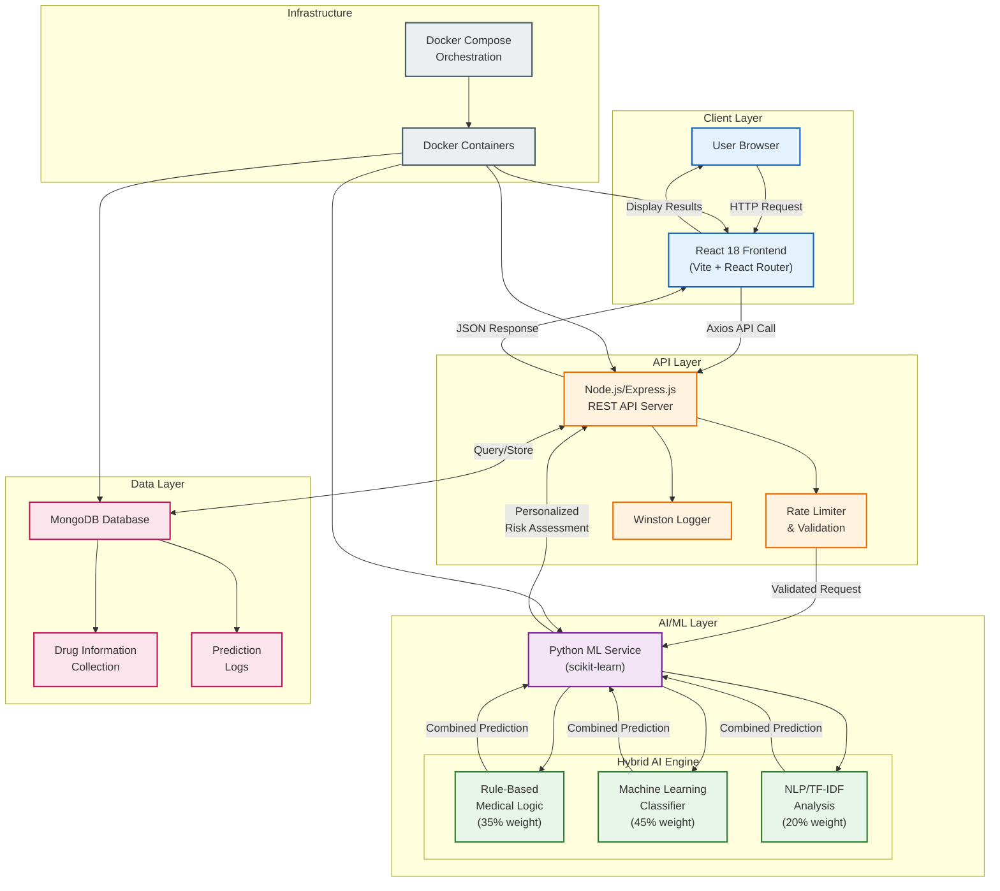
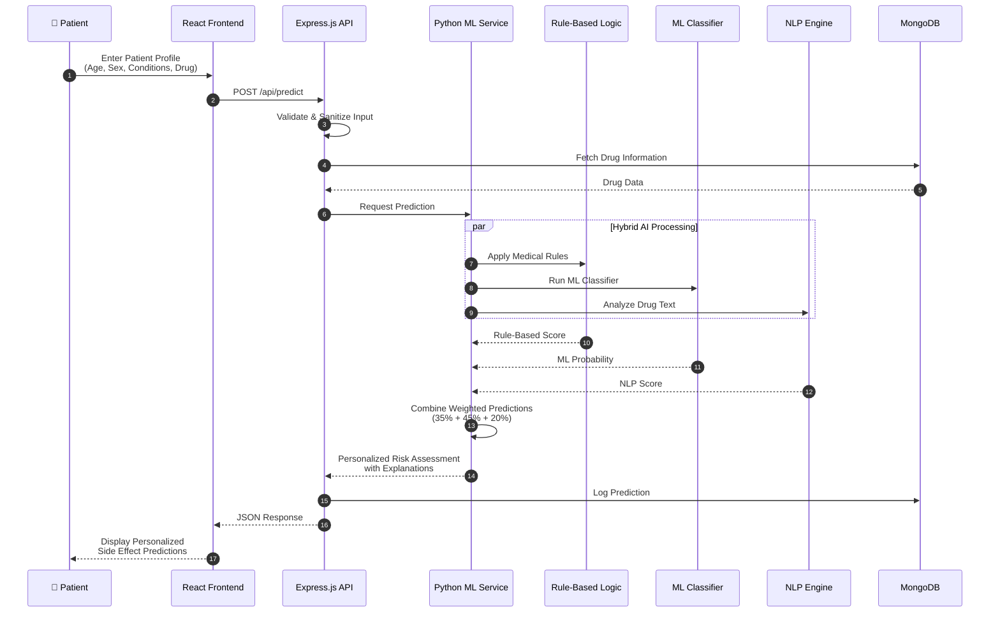

# System Perspective Diagram

## Personalized Medication Side-Effect Predictor

This diagram illustrates the high-level architecture and interactions between the major components of the Personalized Medication Side-Effect Predictor system.

---

## Component Descriptions

### Client Layer

| Component | Technology | Responsibilities |
|-----------|------------|------------------|
| **User Browser** | Web Browser | End-user interface for medication queries and viewing personalized predictions |
| **React Frontend** | React 18, Vite, React Router | Single-page application with responsive UI, form inputs for patient data, and visualizing side effect predictions |

### API Layer

| Component | Technology | Responsibilities |
|-----------|------------|------------------|
| **Node.js/Express Server** | Node.js, Express.js | RESTful API handling all client requests, routing, and response formatting |
| **Rate Limiter & Validation** | express-validator | Input validation, sanitization, and protection against abuse |
| **Winston Logger** | Winston | Comprehensive logging for monitoring, debugging, and audit trails |

### AI/ML Layer (Hybrid AI Engine)

| Component | Weight | Responsibilities |
|-----------|--------|------------------|
| **Rule-Based Medical Logic** | 35% | Encodes established medical knowledge—age-specific risks (elderly 65+, pediatric), condition-drug interactions, demographic factors |
| **Machine Learning Classifier** | 45% | OneVsRestClassifier with Logistic Regression trained on patient data to identify complex patterns in side effect occurrences |
| **NLP/TF-IDF Analysis** | 20% | Text analysis of drug descriptions to extract semantic relationships between medications and side effects |
| **Python ML Service** | scikit-learn, pandas, NumPy | Orchestrates all AI components, feature engineering, model training, and prediction generation |

### Data Layer

| Component | Technology | Responsibilities |
|-----------|------------|------------------|
| **MongoDB Database** | MongoDB, Mongoose ODM | Flexible NoSQL storage for complex drug information with varying structures |
| **Drug Information** | MongoDB Collection | Stores medication data, side effects, contraindications, and descriptions |
| **Prediction Logs** | MongoDB Collection | Maintains history of predictions for analytics and model improvement |

### Infrastructure

| Component | Technology | Responsibilities |
|-----------|------------|------------------|
| **Docker Containers** | Docker | Containerization for consistent deployment across environments |
| **Docker Compose** | docker-compose.yml | Multi-service orchestration of frontend, backend, Python ML, and database |

---

## Data Flow

---

## Key System Features

### Explainability & Transparency
- ✅ Every prediction includes detailed explanation of contributing factors
- ✅ Users see how age, sex, and conditions influenced each side effect probability
- ✅ System shows which prediction method contributed most (Rules, ML, or NLP)
- ✅ Confidence scores indicate prediction reliability

### Security & Reliability
- 🔒 Rate limiting protects against API abuse
- 🔒 Input validation and sanitization prevents injection attacks
- 🔒 Environment-based configuration for secrets management
- 🔒 CORS configuration for secure cross-origin requests

### Scalability
- 📈 Containerized architecture supports horizontal scaling
- 📈 MongoDB's flexible schema handles growing drug databases
- 📈 Stateless API design enables load balancing
- 📈 Modular AI components can be upgraded independently

---

## Technology Stack Summary

| Layer | Technologies |
|-------|-------------|
| **Frontend** | React 18, Vite, React Router, Axios, CSS |
| **Backend** | Node.js, Express.js, express-validator, Winston |
| **AI/ML** | Python 3, scikit-learn, pandas, NumPy, TF-IDF |
| **Database** | MongoDB, Mongoose ODM |
| **DevOps** | Docker, Docker Compose |
| **Architecture** | Microservices, RESTful API, Hybrid AI |

---

*Image 4.1: System Perspective Diagram for Personalized Medication Side-Effect Predictor*
